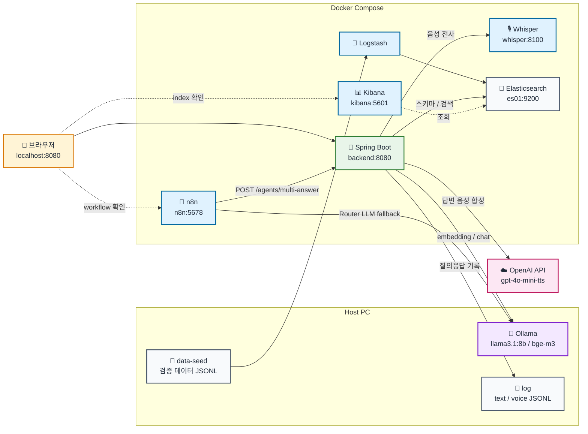
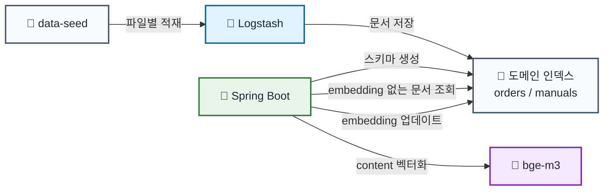
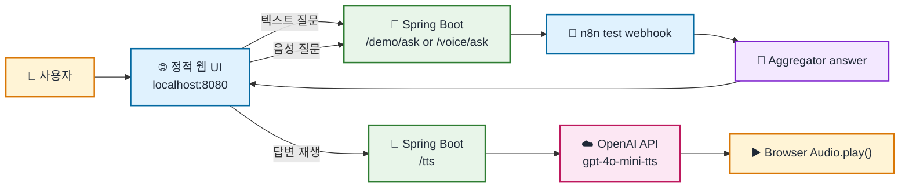
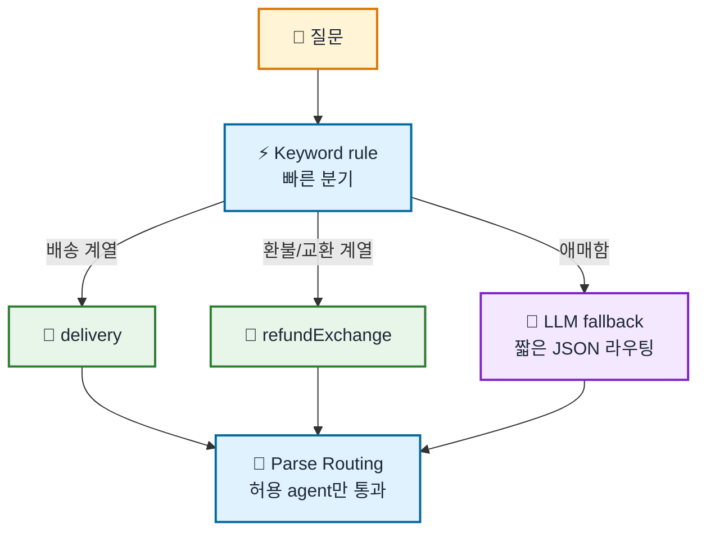
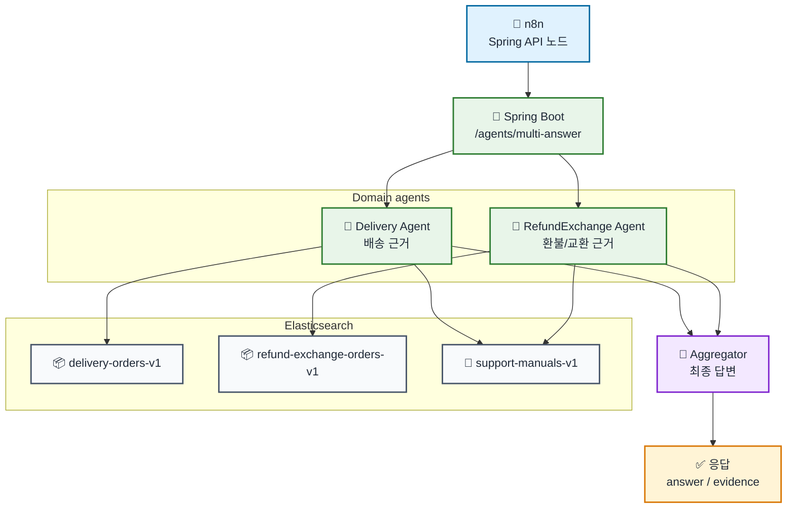
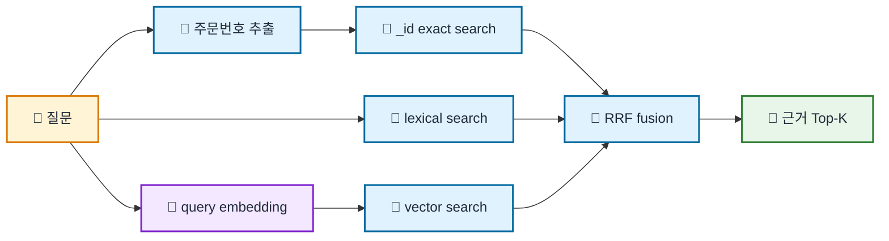

# Consultation Voice Chatbot MVP

Spring Boot + Spring AI, Elasticsearch, n8n, Whisper sidecar, OpenAI TTS API로 구성한 상담 멀티 에이전트 데모다.

목표는 사용자가 텍스트 또는 음성으로 질문하면 n8n workflow가 실행할 도메인 agent를 선택하고, Spring Boot가 도메인별 Elasticsearch 인덱스에서 근거를 찾아 최종 고객 답변을 생성한 뒤, 필요하면 답변을 음성으로 다시 재생하는 구조를 재현 가능하게 만드는 것이다.

핵심 구조:

- n8n은 Router다.
- Spring Boot는 domain agent 실행, hybrid retrieval, Aggregator LLM 호출을 담당한다.
- domain agent는 자기 도메인 인덱스와 공통 매뉴얼 인덱스를 검색해 `판단 / 근거 / 다음행동`을 만든다.
- Aggregator만 LLM을 호출해 agent 결과를 고객용 답변으로 종합한다.
- STT는 Whisper sidecar가 담당하고, 전사된 텍스트는 같은 n8n workflow로 들어간다.
- TTS는 OpenAI gpt-4o-mini-tts API가 담당하고, 웹 UI의 `Play Answer` 버튼이 Spring Boot `/tts`를 통해 최종 답변을 재생한다.

## 구성

- `backend/`: Spring Boot backend. Docker Compose에서 실행한다.
- `whisper/`: FastAPI + faster-whisper STT sidecar. Docker Compose에서 실행한다.
- `n8n/workflows/consultation-multi-agent-mvp.json`: n8n workflow 파일.
- `data-seed/`: Elasticsearch에 적재할 도메인 seed JSONL.
- `log/`: 실행 중 발생한 텍스트/음성 질의응답 로그.
- `logstash/pipeline/`: `data-seed/` 파일을 도메인 인덱스로 적재하는 Logstash pipeline.
- `.env.example`: 환경 변수 템플릿. `.env`로 복사해서 사용한다.

## Architecture



## Data Flow



현재 검색 대상은 도메인 인덱스 3개다.

```text
배송 데이터: delivery-orders-v1
환불/교환 데이터: refund-exchange-orders-v1
상담 매뉴얼: support-manuals-v1
```

임베딩 전 seed 문서는 사람이 읽을 수 있는 업무 필드를 가진 JSONL 한 줄이다.

```json
{
  "orderId": "DLV-1001",
  "status": "옥천 HUB 대기",
  "location": "옥천 HUB",
  "expectedDate": "2026-04-02",
  "content": "주문번호 DLV-1001 배송 조회 결과 현재 옥천 HUB에 있으며 옥천 HUB 대기 상태입니다. 예상 도착일은 2026-04-02입니다."
}
```

Spring Boot의 `EmbeddingBackfillService`가 같은 문서에 `embedding` 필드를 채운다.

```json
{
  "orderId": "DLV-1001",
  "status": "옥천 HUB 대기",
  "location": "옥천 HUB",
  "expectedDate": "2026-04-02",
  "content": "주문번호 DLV-1001 배송 조회 결과 현재 옥천 HUB에 있으며 옥천 HUB 대기 상태입니다. 예상 도착일은 2026-04-02입니다.",
  "embedding": [0.0123, -0.0441, "... 1024 dimensions ..."]
}
```

## Domain Agents

현재 agent는 두 개다.

```text
delivery        배송 상태, 배송 지연, 배송 위치, 도착 예정일
refundExchange  환불, 교환, 오배송, 클레임 처리
```

agent별 검색 대상:

```text
delivery
- delivery-orders-v1
- support-manuals-v1 where domain in ["delivery", "common"]

refundExchange
- refund-exchange-orders-v1
- support-manuals-v1 where domain in ["refundExchange", "common"]
```

domain agent는 LLM agent가 아니다. 로컬 `llama3.1:8b` 환경에서 agent마다 LLM을 호출하면 응답 시간이 길어지기 때문에, 각 domain agent는 retrieval 결과를 코드로 구조화한다. LLM 호출은 마지막 Aggregator에서만 수행한다.

agent 결과 형식:

```text
판단: 근거로 확인 가능한 상태 또는 확인 필요
근거: Elasticsearch 검색 결과에서 확인된 사실
다음행동: 고객에게 안내할 후속 행동 또는 추가 확인 지점
```

## Models

Ollama는 host에서 실행한다. Docker 컨테이너는 `host.docker.internal:11434`로 host Ollama를 호출한다.

```text
- LLM model: llama3.1:8b
- Embedding model: bge-m3
```

모델 준비:

```bash
ollama pull llama3.1:8b
ollama pull bge-m3
ollama serve &
```

## Run

```bash
cp .env.example .env
# .env에서 ELASTIC_PASSWORD, KIBANA_PASSWORD, OPENAI_API_KEY 값을 채운다
docker compose up -d --build
docker compose ps
```

접속:

```text
Web UI: http://localhost:8080/
n8n:    http://localhost:5678/
Kibana: http://localhost:5601/
```

브라우저 데모 흐름:



기본 검증 질문:

```text
제가 시킨거 아직도 안왔어요. 김민준입니다.
```

이 질문은 명시적으로 `배송`이라는 단어가 없어도 `delivery agent`로 라우팅되어야 한다. 단, 주문번호가 없는 질문이므로 agent는 주문 상태를 확정하지 않고 주문번호 등 조회 가능한 정보를 요청해야 한다.

TTS 검증:

```bash
curl -X POST http://localhost:8080/tts \
  -H 'Content-Type: application/json' \
  -d '{"text":"안녕하세요. 배송 상태를 안내드리겠습니다."}' \
  --output answer.mp3
```

웹 UI에서는 최종 답변 렌더링 아래 `Play Answer` 버튼이 같은 `/tts` 엔드포인트를 호출한다.

## n8n Workflow

workflow 파일:

```text
n8n/workflows/consultation-multi-agent-mvp.json
```

현재 MVP는 n8n workflow를 `Publish`하지 않는다. n8n 화면에서 `Execute workflow`를 누른 뒤 `http://localhost:8080/`에서 질문을 보낸다.

workflow 노드 구성:

```mermaid
flowchart LR
    W["🌐 Webhook<br/>test webhook"]
    N["🧹 Normalize Input<br/>입력 정리"]
    R["🔀 Hybrid Router<br/>rule + LLM fallback"]
    P["🧾 Parse Routing<br/>agent 검증"]
    A["🍃 Spring API<br/>/agents/multi-answer"]
    F["📦 Format Response<br/>응답 정리"]
    O["✅ Respond<br/>브라우저 반환"]

    W --> N --> R --> P --> A --> F --> O

    classDef entry fill:#fff4d6,stroke:#d97706,color:#1f2937,stroke-width:2px;
    classDef n8n fill:#e0f2fe,stroke:#0369a1,color:#1f2937,stroke-width:2px;
    classDef spring fill:#e8f5e9,stroke:#2e7d32,color:#1f2937,stroke-width:2px;
    classDef out fill:#f8fafc,stroke:#475569,color:#1f2937,stroke-width:2px;

    class W entry;
    class N,R,P,F n8n;
    class A spring;
    class O out;
```



각 노드 역할:

| 노드                     | 역할                                                                               |
| ------------------------ | ---------------------------------------------------------------------------------- |
| `Webhook`                | Spring Boot의 `/demo/ask` 또는 `/voice/ask`가 호출하는 n8n test webhook 진입점     |
| `Normalize Input`        | 입력 body에서 `question`, `size`를 표준 형태로 정리                                |
| `Hybrid Router`          | 먼저 keyword rule로 agent를 고르고, 애매하면 Ollama LLM fallback으로 라우팅        |
| `Parse Routing`          | Router 결과의 `agents` 배열을 검증하고 허용 agent만 남김                           |
| `Spring Multi-Agent API` | `http://backend:8080/agents/multi-answer`를 호출해 실제 검색/agent/Aggregator 실행 |
| `Format Response`        | Spring 응답을 웹 UI가 쓰기 쉬운 형태로 정리                                        |
| `Respond to Webhook`     | 최종 JSON을 Spring Boot proxy로 반환                                               |

`Hybrid Router`는 빠른 rule-based routing과 LLM fallback을 같이 사용한다.
LLM fallback이 과하게 판단하더라도, 환불/교환 의도가 명시되지 않으면 `refundExchange`는 제거한다.



예를 들어 `제가 시킨거 아직도 안왔어요. 김민준입니다.`는 `배송`이라는 단어가 없어서 keyword rule에 걸리지 않을 수 있다. 이 경우 LLM fallback이 `delivery` agent를 선택한다. fallback은 최종 답변을 만드는 LLM이 아니라, 어떤 agent를 실행할지만 고르는 짧은 JSON 라우터다.

Spring API 호출 이후의 실제 agent/Aggregator 흐름:



역할 구분:

- `n8n Hybrid Router`: 어떤 agent를 실행할지 결정한다.
- `Domain agent`: 자기 도메인 인덱스에서 근거를 찾고 `판단 / 근거 / 다음행동`을 만든다.
- `Aggregator`: 여러 agent 결과를 고객에게 보여줄 최종 답변으로 합친다.
- `Format Response`: Aggregator 답변, agent별 근거, metadata를 웹 UI 응답 형태로 정리한다.

사용 URL:

```text
Spring demo text proxy:
http://localhost:8080/demo/ask

Spring voice proxy:
http://localhost:8080/voice/ask

Spring TTS proxy:
http://localhost:8080/tts

n8n test webhook from backend container:
http://n8n:5678/webhook-test/consultation-multi-agent

Spring multi-agent API from n8n container:
http://backend:8080/agents/multi-answer

OpenAI TTS API from backend container:
https://api.openai.com/v1/audio/speech

Ollama from Docker containers:
http://host.docker.internal:11434
```

주의:

- test webhook은 n8n에서 `Execute workflow`를 누른 뒤에만 동작한다.
- `/demo/ask`는 요청 JSON body를 재조립하지 않고 n8n test webhook으로 그대로 전달한다.
- `/demo/ask`, `/voice/ask`의 Java `HttpClient`는 HTTP/1.1로 고정한다.
- workflow JSON 파일을 수정해도 n8n UI에 이미 가져온 workflow에는 자동 반영되지 않는다.

## Search

Spring Boot는 agent별 도메인 인덱스를 분리해서 검색한다.

```text
delivery        -> delivery-orders-v1 + support-manuals-v1
refundExchange  -> refund-exchange-orders-v1 + support-manuals-v1
```

검색 순서:

1. 질문에서 주문번호를 추출한다.
2. 주문번호가 있으면 `_id` exact search를 먼저 수행한다.
3. `content` lexical search와 `embedding` vector search를 수행한다.
4. app-level RRF로 결과를 합친다.
5. domain agent가 `판단 / 근거 / 다음행동` 구조로 요약한다.
6. Aggregator LLM이 고객용 최종 답변을 만든다.

hybrid retrieval 구성:



주문번호 형식:

```text
배송: DLV-1001 ~ DLV-1050
환불/교환: RFD-2001 ~ RFD-2050
```

용어:

- `exact search`: 주문번호가 질문에 있으면 Elasticsearch document `_id`로 직접 조회한다. 예를 들어 `DLV-1001`은 `delivery-orders-v1`의 `_id=DLV-1001`을 먼저 찾는다.
- `lexical search`: 질문 단어와 문서의 `content` 단어가 얼마나 잘 맞는지 보는 검색이다. 주문번호, 상태명, 배송/환불 같은 명확한 단어에 강하다.
- `vector search`: 질문을 `bge-m3` embedding으로 바꾼 뒤, 문서 embedding과 의미적으로 가까운 문서를 찾는다. 표현이 달라도 의미가 비슷한 질문에 강하다.
- `RRF fusion`: lexical 결과와 vector 결과를 rank 기준으로 합치는 방식이다. 한쪽 검색만 믿지 않고 두 검색 결과를 같이 반영한다.
- `Top-K`: fusion 이후 최종적으로 agent가 참고할 상위 K개 근거다.

현재 설정값:

```text
size = 2
resultSize = max(1, size)
candidateSize = max(resultSize * 4, 20)

vector.k = candidateSize
vector.numCandidates = max(candidateSize, 50)
rankConstant = 60

lexicalWeight = 1.0
vectorWeight = 1.0
exactMatchBonus = 1.0

queryEmbeddingDimensions = 1024
fusionStrategy = app_rrf
```

RRF 공식:

```text
rrfScore(rank) = 1 / (rankConstant + rank)

finalScore(document)
  = lexicalWeight * rrfScore(lexicalRank)
  + vectorWeight  * rrfScore(vectorRank)
  + exactMatchBonus_if_order_id_matched
```

한쪽 검색 결과에만 나온 문서는 다른 쪽 rank 기여도를 0으로 계산한다.

```text
lexicalRank is null -> lexical contribution = 0
vectorRank is null  -> vector contribution = 0
```

## Runtime Logs

실행 로그는 `/log`에 저장된다.
Docker backend는 `./log:/log`를 mount한다.

```text
- 텍스트 검색 로그: log/text-interactions.jsonl
- 음성 검색 로그: log/voice-interactions.jsonl
```
